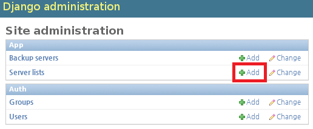
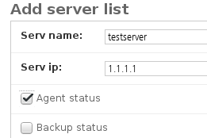
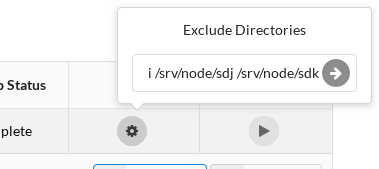

# 클라이언트 설치 메뉴얼

ReaR(Relax and Recover) 및 osbackup 클라이언트 에이전트 설치 메뉴얼<br>
version 1.0 (2016.01.26)

# 목차

- ReaR 설치
- 클라이언트 에이전트 설치 및 구동
- 서버 리스트에 항목 추가
- 테스트

# 0. 파일 구성

- ClientAgent.py (osbackup 클라이언트 에이전트)
- daemon.py (서버와 소켓 통신)
- readme.md (메뉴얼)
- setup.sh (자동 파일)

# 1. ReaR 설치

## [사전준비] 클라이언트 OS 버전에 맞는 Repository 설정 (EPEL 포함)

- RHEL/CentOS 6 이상 버전에는 EPEL Repository에 ReaR가 포함되어 있음
- RHEL/CentOS 5 이하 버전에는 rpm 파일 통한 설치 필요 (별도 설명 없음)

## ReaR가 사용하는 구성 요소 설치

```
yum install -y nfs-utils syslinux mtools genisoimage
```

## ReaR 설치

```
yum install -y rear
```

# 2. 클라이언트 에이전트 설치 및 구동

## git 설치

```
yum install -y git
```

## git을 통해 /opt 위치에 클라이언트 에이전트 파일 다운로드

```
cd /opt
git clone http://10.12.11.70/zzaezzae/osbackup_client.git
```

## setup.sh 실행

```
cd /opt/osbackup_client
./setup.sh OS백업서버IP 
```

ex) ./setup.sh 10.12.17.60

### setup.sh가 하는 작업

- ReaR /etc/rear/local.conf 파일과 에이전트 ClientAgent.py 파일에 서버 IP 등록
- ReaR /usr/share/rear/conf/default.conf 파일에 날짜 PREFIX 추가

## 방화벽 포트 오픈

방화벽 사용할 경우 에이전트 통신 위해 10012 TCP 포트 오픈

## 클라이언트 에이전트 구동

```
python /opt/osbackup_client/ClientAgent.py start
```

재부팅 후에도 자동 구동을 원한다면 /etc/rc.d/rc.local 파일을 이용한다.

## 클라이언트 에이전트 구동 확인

```
netstat -ntple | grep 10012
```

정상 상태 예)

```
# netstat -ntple | grep 10012
tcp        0      0 0.0.0.0:10012           0.0.0.0:*               LISTEN      0          3264765028 52720/python        
# 
```

# 3. 서버 리스트에 항목 추가

## 서버 django admin 페이지 접속, Server list 테이블의 Add 버튼 클릭

Server DB에 신규 클라이언트 추가하는 과정



## hostname/IP 추가, Agent Status 체크

hostname/IP 추가는 필수

Agent Status 체크하지 않을 경우 초반 Agent Status가 ERR로 보일 수 있음



# 4. 테스트

## Exclude 디렉토리 리스트 설정

띄어쓰기 혹은 콤마로 디렉토리 구분 가능



## 백업 Go Go

